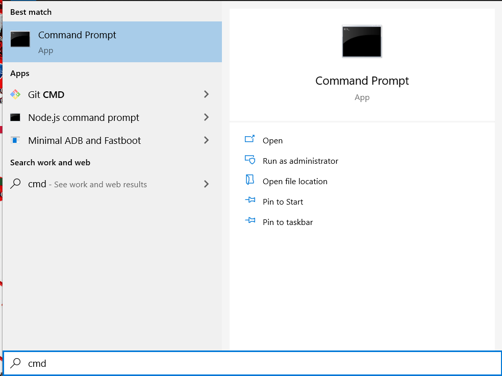
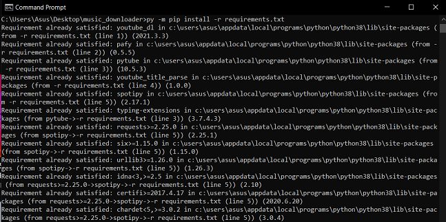
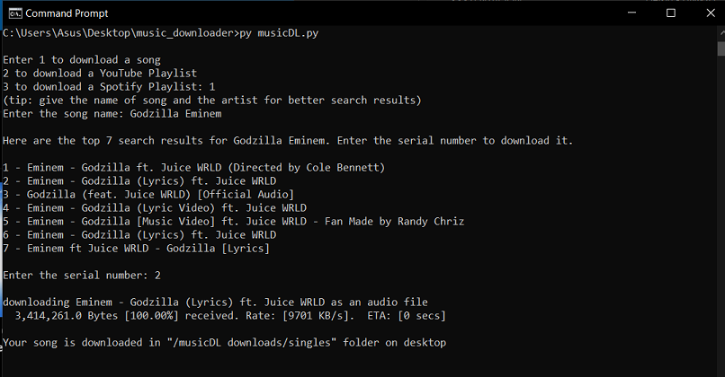
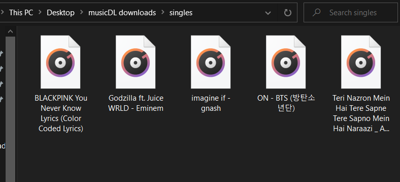
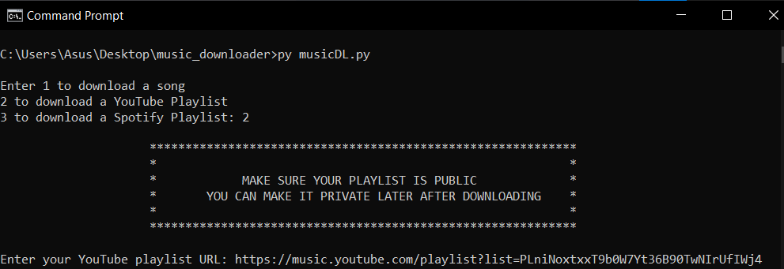
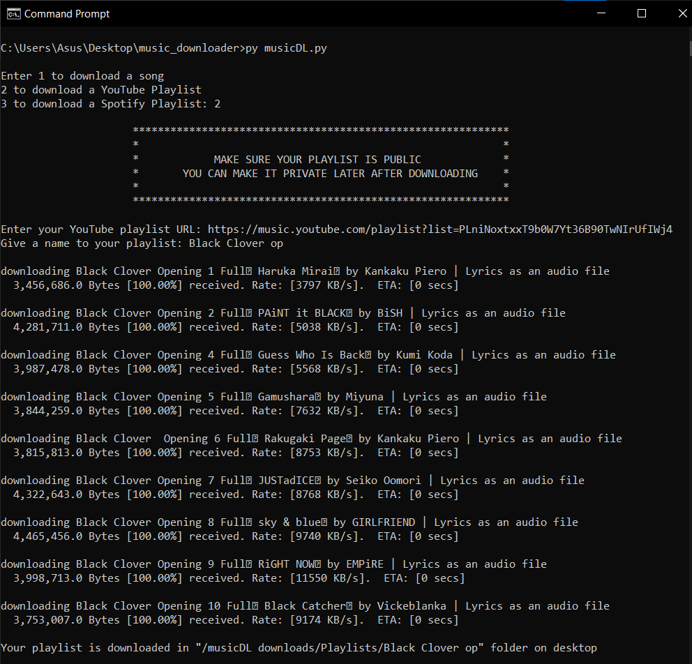
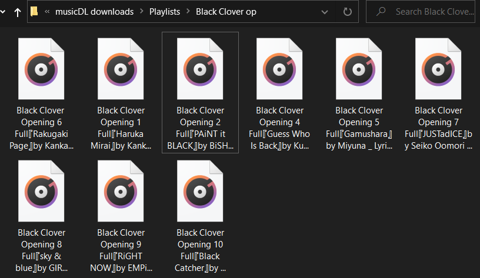
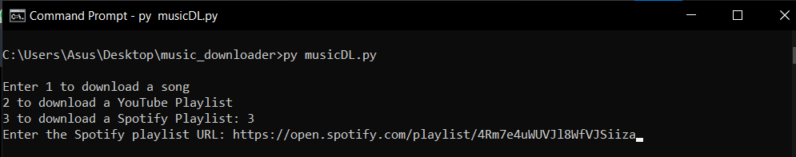
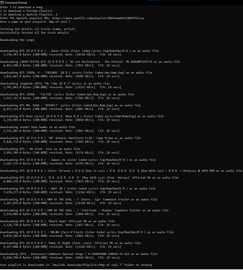
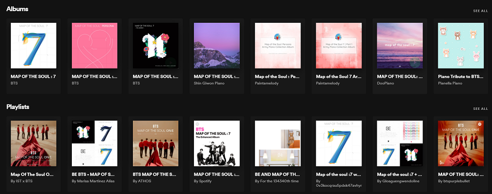

# Hola! 
## What does this app do? 🤨
#### Well this is a simple python app which uses different libraries to basically download music. It downloads:
* Single songs.
* YouTube Playlists (the public ones).
* Spotify Playlists.

## Why did I make it ❓
#### Come on, let's be honest here, we all wanted to listen to that one playlist to which we've been adding songs over a long time on spotify or youtube but we've tons of annoying ads. And we wanna listen to those songs offline too! but don't wanna pay 😬 so that's when I decided to make this app.

## Who is this for?
#### You! (basically anyone who loves listening to music).

## What should you know to get started with this app?
#### You don't have to know anything technical about programming or whatever. Just know how to install stuff and how to open stuff lol. And have [Python 3.x](https://www.python.org/downloads/release/python-383/) installed.

## What should you do to get this app rolling?
    Follow the following steps carefully. The setup could be a bugger. But the reward is worth it.

## Here are the Sections:
* [Windows Setup](https://github.com/insaiyancvk/music_downloader#windows-setup)
    * [prerequisites](https://github.com/insaiyancvk/music_downloader#get-the-stuff)
    * [download source code](https://github.com/insaiyancvk/music_downloader#step-1-download-the-source-code-aka-cloning)
    * [install libraries](https://github.com/insaiyancvk/music_downloader#step-2-install-whatever-libraries-are-required)
* [Linux Setup](https://github.com/insaiyancvk/music_downloader#linux-setup)
* [run the code](https://github.com/insaiyancvk/music_downloader#start-the-code)
* [the options](https://github.com/insaiyancvk/music_downloader#so-there-are-3-options)
    * [single song](https://github.com/insaiyancvk/music_downloader#1-single-song)
    * [youtube playlist](https://github.com/insaiyancvk/music_downloader#2-youtube-playlist)
    * [spotify playlist](https://github.com/insaiyancvk/music_downloader#3-spotify-playlist)

## Windows Setup
### Here's what you have to do if you're on Windows:

#### Get the stuff:

* Install [Python 3](https://www.python.org/ftp/python/3.8.3/python-3.8.3-amd64.exe)
* Install Git
    * Use [this](https://github.com/git-for-windows/git/releases/download/v2.30.2.windows.1/Git-2.30.2-32-bit.exe) if you're on 32-bit
    * Use [this](https://github.com/git-for-windows/git/releases/download/v2.30.2.windows.1/Git-2.30.2-64-bit.exe) if you're on 64-bit
* Open Command Prompt (aka `cmd`) (start ➡ search 'cmd' ➡ open 'Command Prompt'). Check the image below for reference:


## **Note:** Copy and paste all the following commands in 'Command Prompt' (one that you opened)

### Now comes the real CoDiNg stuff


## Step 1: Download the source code (aka cloning)

```
cd %USERPROFILE%/Desktop
git clone https://github.com/insaiyancvk/music_downloader
cd music_downloader
```
Here's how it looks like (more or less):


So what we just did with the above code is:
* we changed the directory to desktop (navigating to desktop).
* downloaded whatever code I put in my github repository.
* changed the directory to the repository that was downloaded.

## Step 2: Install whatever libraries are required.

```
pip install -r requirements.txt
```

If that doesn't work, maybe try this:

```
py -m pip install -r requirements.txt
```

Here's how it looks like in my cmd:


>I get "Requirement already satisfied" because I already have all of those libraries intsalled. 😬

So when you give that command, it downloads all the libraries that I used in my code. If any of them is not downloaded, then my code doesn't work :(

## Linux Setup
### Here's what you've to do if you're on Linux:
So if you're on Linux, I'm assuming you're pretty pro at these stuff 😏

So I'll jump straight on point.

Copy and paste these stuff assuming that you've python 3.x and git installed:
```
git clone https://github.com/insaiyancvk/music_downloader
cd music_downloader
pip install -r requirements.txt
```

## _Omedetou_ for making it till here. We're done with all the setup!


## Now comes the Good stuff:
RUNNING THE DAMN CODE AND DOWNLOADING ALL THE SONGS!


# Start the Code!

Paste this command to run the main program

`py musicDL.py`

Here's a preview:


### So there are 3 options:
1. Download a single song
2. Download a Youtube Playlist
3. Download a Spotify Playlist

## Let me show how each of these options will look like:
### 1. Single song

Here is an example:



Here is the output:


PS: I listened to Godzilla literally after I downloaded for this demo 😆

### 2. Youtube Playlist

Here is an example:

You have to paste the playlist (from YT or YT music) link here and then give a name to your playlist, like it's shown below:


Here's how the code downloading the playlist looks like:


Here is the output:


Okay, you might ask, where I got the link from. Here's where I got it from:


Literally from Youtube music

### 3. Spotify Playlist

Here's an example:



Here's how it looks like when it's downloading:



Here's the output:


PS: I listened to 'We are Bulletproof' after downloading this playlist 😆

>**NOTE**: There's a difference between a 'Playlist' and an 'Album' in Spotify. So be aware of what link you are going to paste in the code.

Check this picture of 'Albums' and 'Playlists':


## How to reuse this code?
So Command Prompt is the place where you run this code. (you can try IDLE,VS Code,PyCharm etc)
So here are the commands you have to follow:
```
cd %USERPROFILE%/Desktop
cd music_downloader
py musicDL.py
```

>**NOTE**: DO NOT DELETE/MOVE 'music_downloader' FOLDER FROM DESKTOP. If you delete it that then you'll have to clone the repository again and follow through this tutorial again 😕 If you move 'music_downloader' folder to some other folder then you've to navigate to wherever you moved the code to and run `py musicDL.py`


## There you go! You learned how to download songs using my code!
## Now go ahead and _**V I B E**_ with all the songs you downloaded!
