# Hola! 
Considering you reading this, I assume you're here to download some songs 😏 Well you are at the right place!
## What does this app do? 🤨
#### Well this is a simple python app which uses different libraries to basically download music. It downloads:
* Single songs.
* YouTube Playlists (the public ones).
* Spotify Playlists/Albums.

## Why did I make it ❓
#### Come on, let's be honest here, we all wanted to listen to that one playlist(or album) to which we've been adding songs over a long time on spotify or youtube but we've tons of annoying ads. And we wanna listen to those songs offline too! but don't wanna pay 😬 so that's when I decided to make this app.

## Who is this for?
#### You! (basically anyone who loves listening to music).

## What should you know to get started with this app?
#### You don't have to know anything technical about programming or whatever. Just know how to install stuff and how to open stuff lol.

## What should you do to get this app rolling?
> Follow the steps. The setup is [ez](https://www.google.com/search?q=ez+meaning&oq=ez+meaning&aqs=chrome..69i57.1754j0j1&sourceid=chrome&ie=UTF-8). And running the app is also ez.

## What libraries did I use in my code?
Here are the libraries that I used:
* `pytube`
* `pafy`
* `youtube_title_parse`
*  `spotipy`

## Here are the Sections:
* [Windows Setup](https://github.com/insaiyancvk/music_downloader#windows-setup)
    * [download executable file](https://github.com/insaiyancvk/music_downloader#get-the-stuff)
    * [install `setup.exe`](https://github.com/insaiyancvk/music_downloader#step-1-install-setupexe)
    * [run `musicDL.exe`](https://github.com/insaiyancvk/music_downloader#step-2-check-musicdlexe-inside-setup-folder)
* [Dev Setup](https://github.com/insaiyancvk/music_downloader#setup-for-devs)
* [run the software](https://github.com/insaiyancvk/music_downloader#start-the-code)
* [the options](https://github.com/insaiyancvk/music_downloader#so-there-are-3-options)
    * [single song](https://github.com/insaiyancvk/music_downloader#1-single-song)
    * [youtube playlist](https://github.com/insaiyancvk/music_downloader#2-youtube-playlist)
    * [spotify playlist](https://github.com/insaiyancvk/music_downloader#3-spotify-playlist)
* [Update the code](https://github.com/insaiyancvk/music_downloader#how-to-update-the-code-when-i-change-something)
* [***V I B E***](https://github.com/insaiyancvk/music_downloader#now-go-ahead-and-v-i-b-e-with-all-the-songs-you-downloaded)

## Windows Setup
### Here's what you have to do if you're on Windows:

#### Get the stuff:

* Get the executable file (`setup.exe`) from [here](https://github.com/insaiyancvk/music_downloader/releases/tag/v2.0.0)


### Now comes the real CoDiNg stuff


jk, just run the file that you downloaded.
## Step 1: Install `setup.exe`
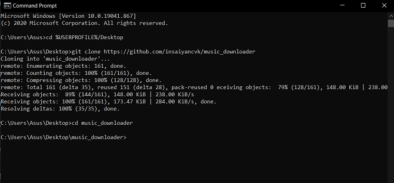
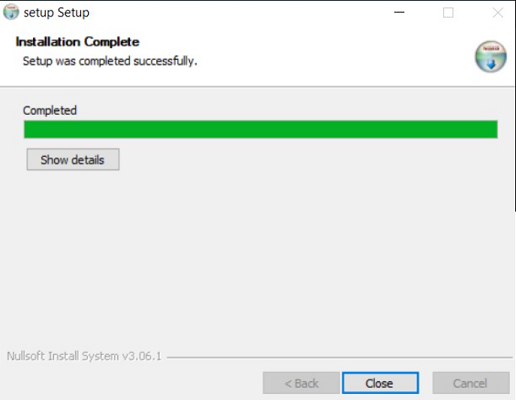

## Step 2: Check `musicDL.exe` inside 'setup' folder

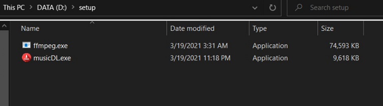
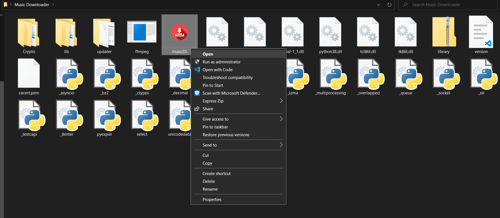

> **Note:** Never seperate whatever is inside setup folder. Because they're BFFs 💘 (jk, musicDL.exe uses ffmpeg.exe for converting the codec and adding album art) (if you want the app on desktop, you can just create a shortcut and put it on desktop)

## Setup for devs

Copy and paste these stuff assuming that you've python 3.x, pip and git installed:
```
git clone https://github.com/insaiyancvk/music_downloader
cd music_downloader
pip install -r requirements.txt
```
Just  `git pull origin main`  inside "music_downloader" for updating your local repo

## [_Omedetou_](https://translate.google.com/?sl=ja&tl=en&text=omedetou&op=translate) for making it till here. We're done with all the setup!


## Now comes the Good stuff:
RUNNING THE DAMN CODE AND DOWNLOADING ALL THEM SONGS!


# Start the Code!

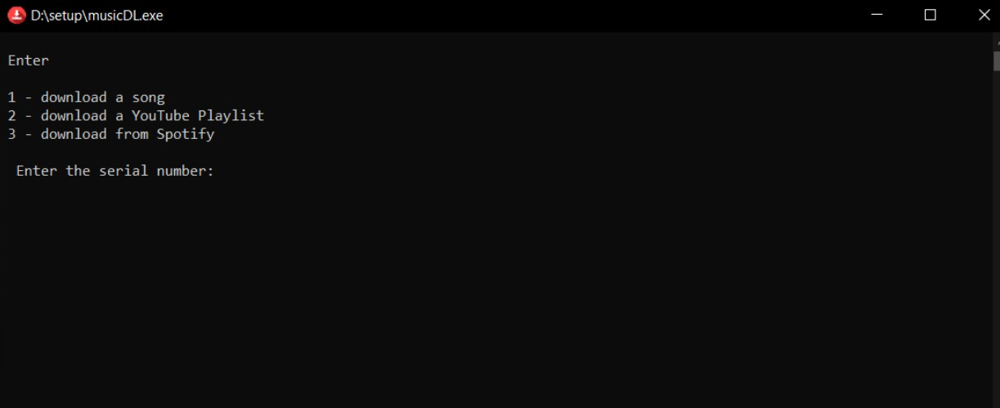

### So there are 3 options:
1. Download a single song
2. Download a Youtube Playlist
3. Download from Spotify

## Let me show how each of these options will look like:
### 1. Single song

Here is an example:


Here is the output:

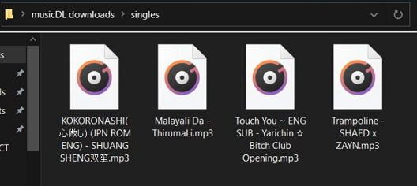

btw this is the folder located on desktop where all your stuff will be downloaded:
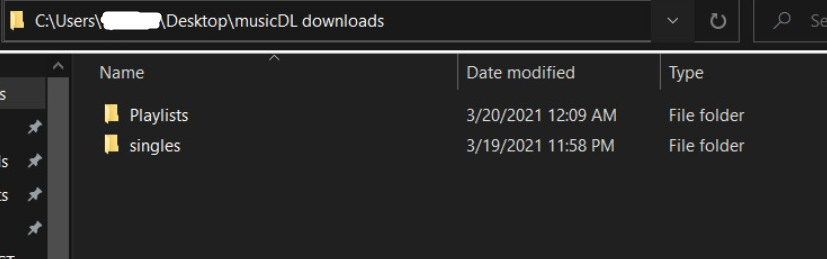

PS: I listened to Trampoline literally after I downloaded for this demo 😆

### 2. Youtube Playlist

Here is an example:

You have to paste the playlist link (from YT or YT music) here and then give a name to your playlist, like it's shown below:

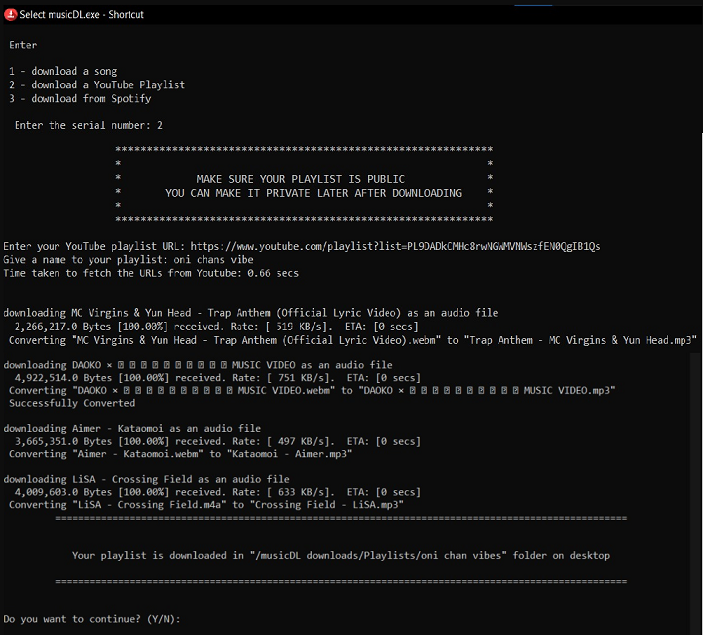

Here is the output:

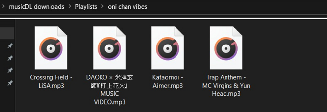

Okay, you might ask, where I got the link from. Here's where I got it from:
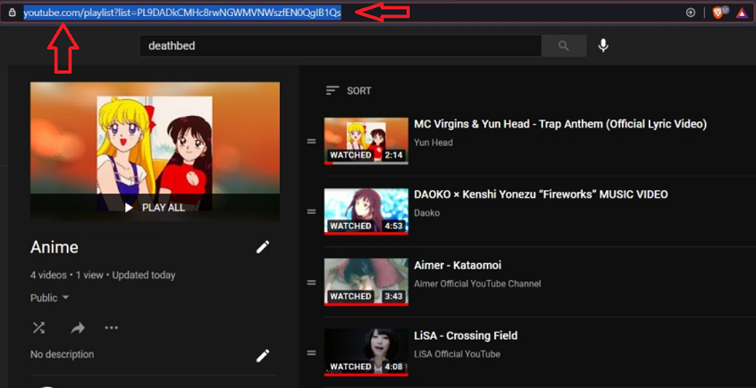

**Note:** Make sure that your playlist is public. You can make it private after downloading the playlist if you want. 

This is what happens if your playlist is private:
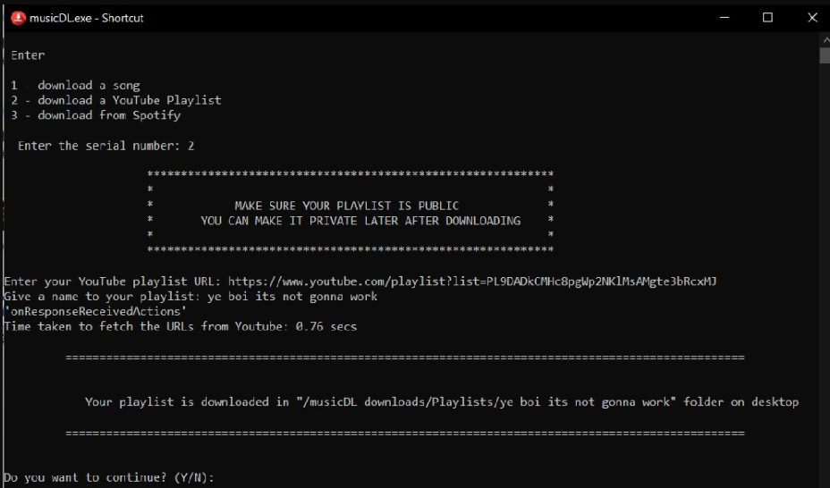

Check this pic for making a playlist public:

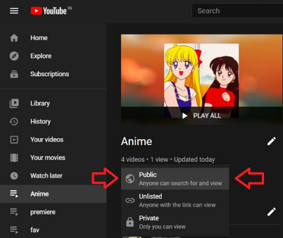

### 3. Spotify Playlist

Here's an example:

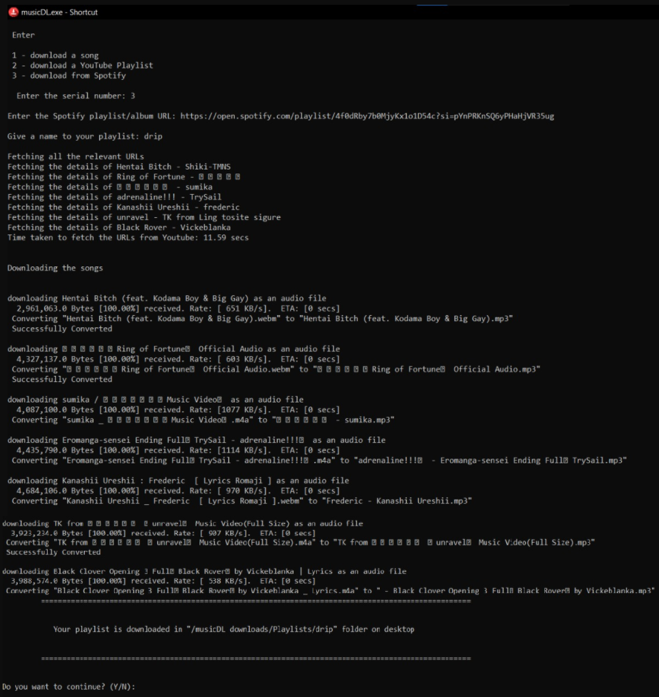

Here's the output:

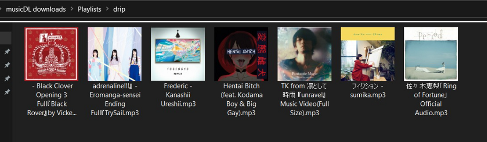

PS: I listened to 'Unravel' after downloading this playlist 😆

>**NOTE**: Consider going for downloads based on spotify if you're a fan of album art. Check the pic below which got tons of songs with album art:

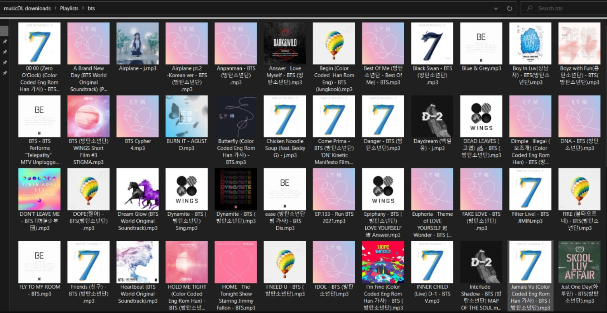

Wondering if you should copy the playlist/album URL or URI? well I added support for both of them!

 Here's where you can find it:

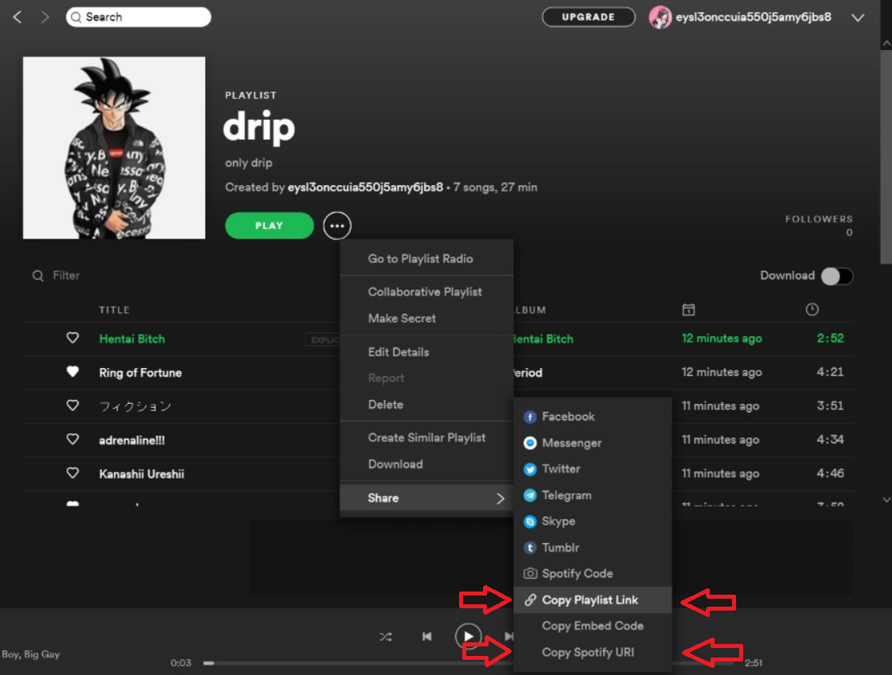

This image shows for playlist, but it's similar for albums too!

## How to update the code when I change something?
Check If I released a new version at my repo!

## There you go! You learned how to download songs using my code!
## Now go ahead and _**V I B E**_ with all the songs you downloaded!


What next?
* So I'm working on adding album support for spotify right now. ✔
* Will make an attempt to make a windows executable file (.exe) for this app. ✔
* Probably GUI